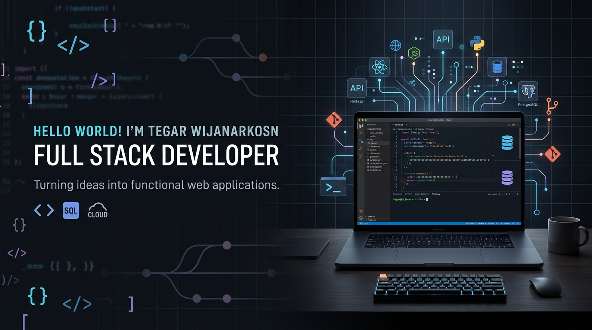
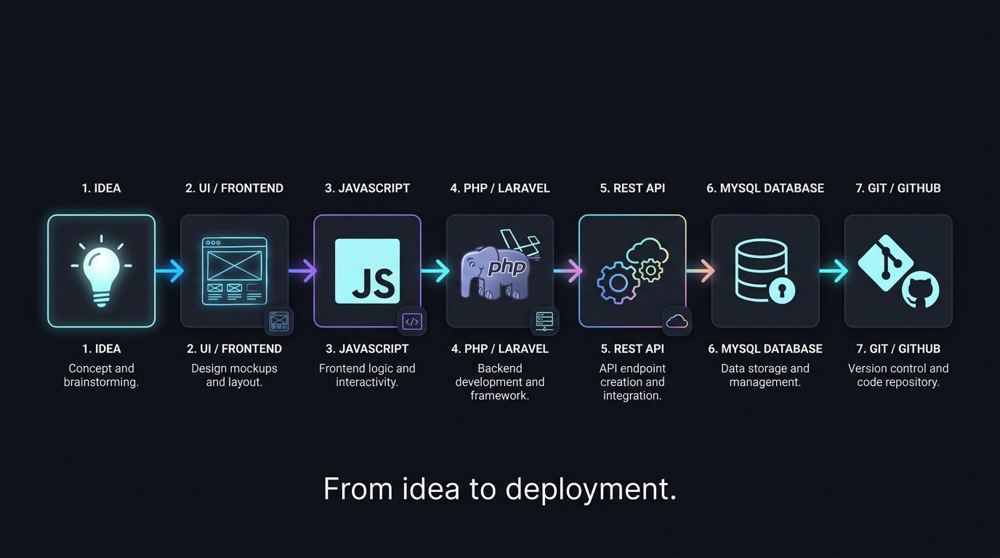

<div align="center">

  

  <br/><br/>

  <h1>Hello World! I'm Tegar Wijanarko S N 👋</h1>

  <p>
    <strong>Full Stack Developer | Web Developer | Software Developer</strong>
  </p>

  <p>
    <em>"I build modern, functional, and scalable web applications from frontend to backend."</em>
  </p>

  <p>
    <code>Building web applications, learning continuously, and turning ideas into working products.</code>
  </p>

  <p>
    <a href="#-lets-connect"></a>
    <a href="#-tech-stack"></a>
    <a href="#-featured-projects"></a>
  </p>

  <br/>

  <blockquote>
    <strong>"Build real projects. Solve real problems. Keep learning."</strong>
  </blockquote>

</div>

---

## 👨‍💻 About Me

I’m a **Full Stack Developer** interested in building web applications that are functional, maintainable, and user-friendly. I enjoy working across the frontend and backend, from designing interfaces and developing application logic to managing databases and building APIs.

Currently, I’m continuously improving my skills through real-world projects, experimentation, and practical problem solving.

---

## 🚀 Currently Focused On

- 🌐 **Building full-stack web applications** with clean architecture and solid database design.
- 🔌 **Developing RESTful APIs** for structured and reliable backend data services.
- 🐘 **Improving Laravel & PHP development** techniques and architectural patterns.
- ⚡ **Strengthening JavaScript** and modern frontend user interface practices.

> **"Always learning. Always building."**

---

## 🛠️ Tech Stack

### Frontend


### Backend


### Database


### Development Tools


### API & Architecture


---

## 💡 Core Skills

<table width="100%">
  <tr>
    <td width="50%" valign="top">
      <h3>🎨 Frontend Development</h3>
      <ul>
        <li>Responsive UI Implementation</li>
        <li>JavaScript Application Logic</li>
        <li>Component-Based Interfaces</li>
        <li>UI/UX Design Implementation</li>
      </ul>
    </td>
    <td width="50%" valign="top">
      <h3>⚙️ Backend Development</h3>
      <ul>
        <li>PHP Core & Frameworks</li>
        <li>Laravel & CodeIgniter Development</li>
        <li>MVC Architecture Pattern</li>
        <li>RESTful API Endpoints</li>
      </ul>
    </td>
  </tr>
  <tr>
    <td width="50%" valign="top">
      <h3>🗄️ Database Engineering</h3>
      <ul>
        <li>MySQL Schema Design</li>
        <li>SQLite Lightweight Databases</li>
        <li>Database Relationships & Indexing</li>
        <li>CRUD Operations Optimization</li>
      </ul>
    </td>
    <td width="50%" valign="top">
      <h3>🛠️ Development Workflow</h3>
      <ul>
        <li>Git Version Control & GitHub</li>
        <li>API Testing & Integration</li>
        <li>Debugging & Error Handling</li>
        <li>Real-World Problem Solving</li>
      </ul>
    </td>
  </tr>
</table>

---

## 🔄 Full Stack Workflow

<div align="center">

  

  <br/><br/>

  ```text
  ┌─────────┐      ┌──────────────┐      ┌────────────┐      ┌──────────────┐
  │  IDEA   │ ───► │ UI / FRONTEND│ ───► │ JAVASCRIPT │ ───► │PHP / LARAVEL │
  └─────────┘      └──────────────┘      └────────────┘      └──────────────┘
                                                                    │
  ┌────────────┐      ┌────────────────┐      ┌─────────────┐       │
  │GIT / GITHUB│ ◄─── │ MYSQL DATABASE │ ◄─── │  REST API   │ ◄─────┘
  └────────────┘      └────────────────┘      └─────────────┘
  ```

  <p><strong>"From idea to deployment."</strong></p>

</div>

---

## 🚀 Featured Projects

<table width="100%">
  <tr>
    <td width="100%">
      <h3>🛒 Retail POS & Inventory Management System</h3>
      <p>A full-stack web application designed to streamline point-of-sale transactions, track warehouse inventory levels in real-time, and generate automated sales analytics reports for retail businesses.</p>
      <p><strong>Tech:</strong> <code>Laravel</code> · <code>PHP</code> · <code>JavaScript</code> · <code>MySQL</code> · <code>Bootstrap</code></p>
      <p><strong>What I built:</strong></p>
      <ul>
        <li>Role-based user authentication and access control for cashiers and managers.</li>
        <li>Automated real-time stock deduction system upon transaction completion.</li>
        <li>Dynamic invoice printing and exportable sales summary reports.</li>
      </ul>
      <p><a href="https://github.com/tegaroke"><strong>View Project →</strong></a></p>
    </td>
  </tr>
  <tr>
    <td width="100%">
      <h3>🎓 Academic & Student Information Portal</h3>
      <p>An integrated web information system for educational institutions to handle student course registrations, academic records, and grade transcript publishing efficiently.</p>
      <p><strong>Tech:</strong> <code>Laravel</code> · <code>CodeIgniter</code> · <code>PHP</code> · <code>MySQL</code> · <code>Tailwind CSS</code></p>
      <p><strong>What I built:</strong></p>
      <ul>
        <li>Relational database schema mapping student profiles, courses, and grade points.</li>
        <li>Interactive admin dashboard with dynamic filtering and student search.</li>
        <li>Secure authentication and audit trail for grade updates.</li>
      </ul>
      <p><a href="https://github.com/tegaroke"><strong>View Project →</strong></a></p>
    </td>
  </tr>
  <tr>
    <td width="100%">
      <h3>🔌 E-Commerce Backoffice RESTful API</h3>
      <p>A high-performance backend API service providing catalog management, user cart sessions, order processing, and payment status updates for e-commerce platforms.</p>
      <p><strong>Tech:</strong> <code>Laravel</code> · <code>PHP</code> · <code>REST API</code> · <code>MySQL</code> · <code>Postman</code></p>
      <p><strong>What I built:</strong></p>
      <ul>
        <li>Token-based API authentication using Laravel Sanctum for secure endpoints.</li>
        <li>Standardized JSON response structures with explicit HTTP error status handling.</li>
        <li>Postman API documentation for seamless client integration.</li>
      </ul>
      <p><a href="https://github.com/tegaroke"><strong>View Project →</strong></a></p>
    </td>
  </tr>
  <tr>
    <td width="100%">
      <h3>📋 Agile Task & Workspace Manager</h3>
      <p>A responsive web workspace allowing software teams to create project boards, assign task tickets, update workflow statuses, and monitor sprint deadlines.</p>
      <p><strong>Tech:</strong> <code>JavaScript</code> · <code>PHP</code> · <code>Laravel</code> · <code>MySQL</code> · <code>Tailwind CSS</code></p>
      <p><strong>What I built:</strong></p>
      <ul>
        <li>Interactive task card status management with instant AJAX updates.</li>
        <li>Full CRUD functionality for project boards, tasks, and member assignments.</li>
        <li>Database indexing for rapid search across active and archived task lists.</li>
      </ul>
      <p><a href="https://github.com/tegaroke"><strong>View Project →</strong></a></p>
    </td>
  </tr>
</table>

---

## 📊 GitHub Activity

<div align="center">
  <table border="0" style="border-collapse: collapse;">
    <tr>
      <td align="center">
        
      </td>
      <td align="center">
        
      </td>
    </tr>
  </table>
  <br/>
  
</div>

---

## 🧠 Development Philosophy

<table width="100%">
  <tr>
    <td width="33%" align="center">
      <h3>01 — Build</h3>
      <p><em>"Learn by building real projects."</em></p>
      <p>Theory matters, but true understanding comes from hands-on creation and turning concepts into software.</p>
    </td>
    <td width="33%" align="center">
      <h3>02 — Improve</h3>
      <p><em>"Refactor, optimize, and continuously improve."</em></p>
      <p>Code is never final. Strive for cleaner structure, better performance, and maintainable logic over time.</p>
    </td>
    <td width="34%" align="center">
      <h3>03 — Share</h3>
      <p><em>"Document knowledge and learn from community."</em></p>
      <p>Growth accelerates when we document solutions, share progress, and collaborate with other developers.</p>
    </td>
  </tr>
</table>

---

## 📚 Currently Learning

- 🔄 **Advanced Laravel Architecture** — *Currently exploring microservices, event-driven queues, and custom package creation.*
- ⚡ **Modern JavaScript Techniques** — *Currently improving async workflows, state management, and clean modular code.*
- 🔌 **REST API Security & Design** — *Currently exploring rate limiting, API gateways, and standardized API contracts.*
- 🗄️ **Database Query Optimization** — *Currently improving SQL indexing strategies, execution plan tuning, and schema design.*
- 🧼 **Clean Code & SOLID Principles** — *Currently exploring software architecture design patterns and refactoring methods.*
- 🚢 **Deployment & Server Administration** — *Currently improving Web Hosting, Nginx configuration, CI/CD, and server setup.*

---

## 🌐 Let's Connect

<div align="center">

  <p><strong>"Have an idea, project, or collaboration in mind? Let's build something useful together."</strong></p>

  <br/>

  <a href="https://github.com/tegaroke" target="_blank">
    
  </a>
  <a href="https://linkedin.com/in/tegar-wijanarko" target="_blank">
    
  </a>
  <a href="https://instagram.com/tegar.wijanarko" target="_blank">
    
  </a>
  <a href="mailto:tegar.wijanarko@example.com">
    
  </a>

</div>

---

<div align="center">

```text
───────────────────────────────────────────────────────────────────────────────

Thanks for visiting my profile.

< Code. Build. Learn. Repeat. />

───────────────────────────────────────────────────────────────────────────────
```

<p>© 2026 Tegar Wijanarko S N. All rights reserved.</p>

</div>
